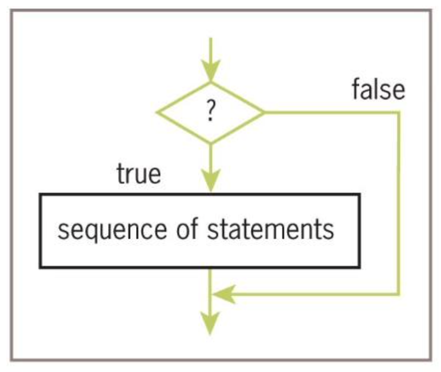
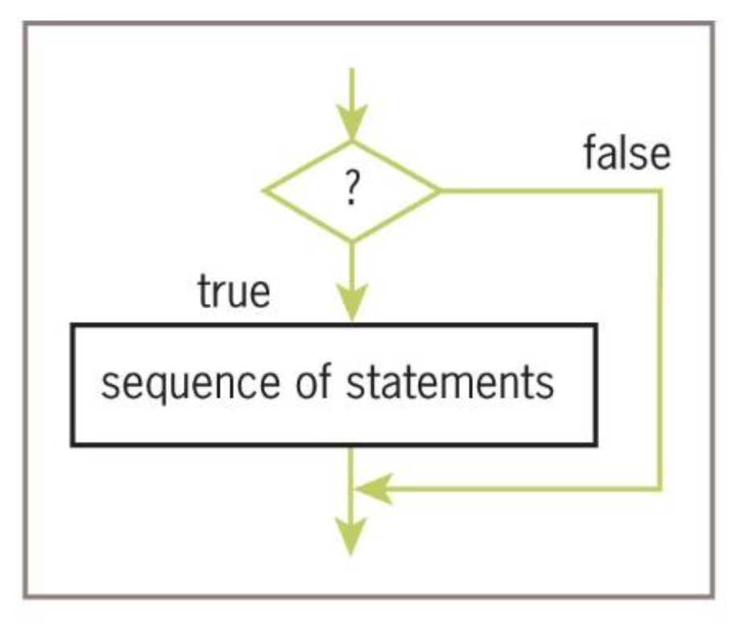
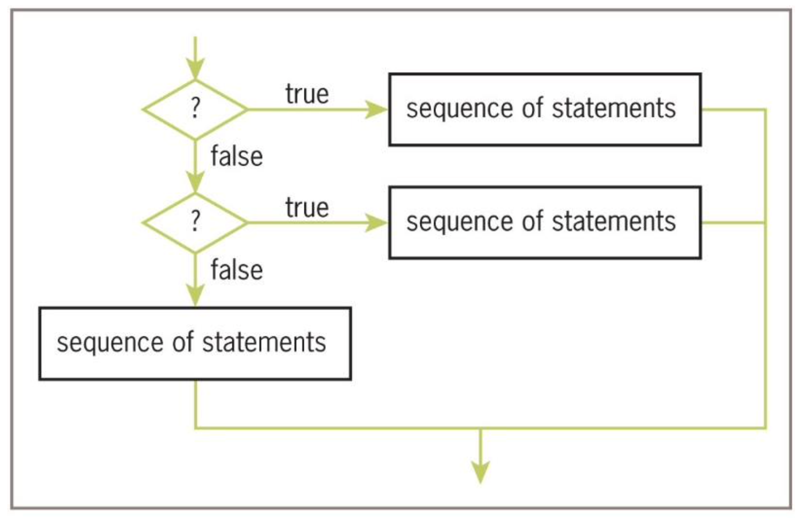
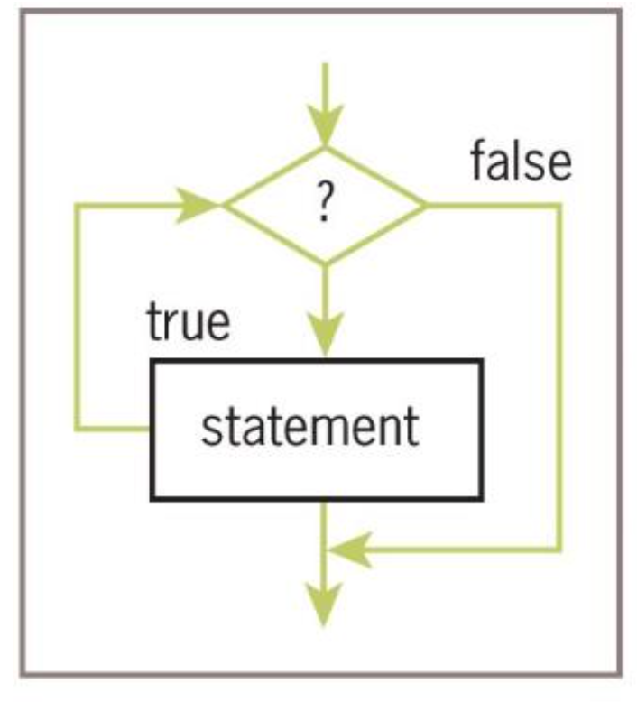

## Contents

- Definite Iteration: The `for` Loop
  - Executing Statements a Given Number of Times
  - Count-Controlled Loops
  - Loop Errors: Off-by-One Error
  - Augmented Assignment
  - Traversing Sequences
  - Specifying Steps in Range
  - Loops that Count Down
- Formatting Text for Output
  - Field Widths
  - Formatting Strings, Integers, and Floats
- Selection Statements
  - Boolean Type and Comparisons
  - One-Way (`if`)
  - Two-Way (`if-else`)
  - Multi-Way (`if-elif-else`)
- Logical Operators and Compound Boolean Expressions
  - Truth Tables
  - Short-Circuit Evaluation
- Conditional Iteration: The `while` Loop
  - Structure and Behavior
  - Count Control with `while`
  - The `while True` Loop and `break`
- Random Numbers
- Loop Logic, Errors, and Testing

# Definite Iteration: The `for` Loop

## Introduction to Loops

- Repetition statements (or **loops**) repeat an action
- Each repetition is known as a **pass** or **iteration**
- Two types of loops:
  - **Definite iteration** - Repeats a predefined number of times
  - **Indefinite iteration** - Repeats until program determines it needs to stop

## Executing a Statement a Given Number of Times (1 of 2)

Python's `for` loop is the control statement that most easily supports definite iteration

```{python}
for eachPass in range(4):
    print("It's alive!", end=" ")
```

### Loop Structure

for &lt;variable&gt; in range(&lt;an integer expression&gt;):

- First line is the **loop header**
- Rest of code is the **loop body** (must be indented and aligned)

## Executing a Statement a Given Number of Times (2 of 2)

### Example: Computing Exponentiation

```{python}
number = 2
exponent = 3
product = 1
for eachPass in range(exponent):
    product = product * number
    print(product, end=" ")
```

```{python}
print(product)
```

**Note:** If the exponent were 0, the loop body would not execute and `product` would remain 1.

## Count-Controlled Loops (1 of 3)

Loops that count through a range of numbers:

```{python}
product = 1
for count in range(4):
    product = product * (count + 1)

print(product)
```

### Explicit Lower Bound

```{python}
product = 1
for count in range(1, 5):
    product = product * count
print(product)
```

## Count-Controlled Loops (2 of 3)

### Example: Bound-Delimited Summation

```python
lower = int(input("Enter the lower bound: "))
upper = int(input("Enter the upper bound: "))
theSum = 0
for number in range(lower, upper + 1):
    theSum = theSum + number
theSum
```

**Sample Run:**
```
Enter the lower bound: 1
Enter the upper bound: 10
```

**Output:**
```
55
```

## Count-Controlled Loops (3 of 3)

### General Structure

for &lt;variable&gt; in range(&lt;lower bound&gt;, &lt;upper bound + 1&gt;):

### Check Your Understanding

For the following code:

```python
for i in range(4, 11):
    print(i ** 2)
```

- **How many iterations will this run?**
- **What is the output?**

## Your turn

**Your turn**

Write a program that prints out the following

```text
Counting up:
1
2
3
4
5
We have counted from 1 to 5!
```

```{pyodide-python}

```

## Loop Errors: Off-by-One Error

### Example of a Logic Error

```{python}
# Count from 1 through 4, we think
for count in range(1, 4):
    print(count)
```

- Loop actually counts from 1 through 3
- Not a syntax error, but rather a **logic error**
- Remember: `range(start, stop)` goes up to but **not including** `stop`

## Augmented Assignment

The assignment symbol can be combined with arithmetic and concatenation operators:

```{python}
a = 17
s = "hi"

a += 3        # Equivalent to a = a + 3
a -= 3        # Equivalent to a = a - 3
a *= 3        # Equivalent to a = a * 3
a /= 3        # Equivalent to a = a / 3
a %= 3        # Equivalent to a = a % 3
s += " there" # Equivalent to s = s + " there"
```


&lt;variable&gt; &lt;operator&gt;= &lt;expression&gt;

Equivalent to:

&lt;variable&gt; = &lt;variable&gt; &lt;operator&gt; &lt;expression&gt;

## Traversing the Contents of a Data Sequence

`range` returns a **list**:

```{python}
list(range(4))
```

```{python}
list(range(1, 5))
```

### Strings as Sequences

Strings are also sequences of characters:

```{python}
for character in "Hi there!":
    print(character, end=" ")
```

**Note:** the `print()` function has an option `end` which takes in a string on how the output should end.
```{python}
help(print)
```

## Specifying the Steps in Range

`range` accepts a third argument for **step value**:

```{python}
for i in range(0, 11, 2):
    print(i)
```


```{python}
for i in range(0, 7, 3):
    print(i)
```

### General Structure

for &lt;variable&gt; in range(&lt;lower bound&gt;, &lt;upper bound + 1&gt;, &lt;step value&gt;):
    &lt;loop body&gt;

## Loops that Count Down

Use a negative step value:

```{python}
for count in range(10, 0, -1):
    print(count, end=" ")
```

```{python}
list(range(10, 0, -1))
```

### Sum of Even Numbers

```{python}
theSum = 0
for count in range(2, 11, 2):
    theSum += count
print(theSum)
```

# Formatting Text for Output

## Introduction to Formatting

Many data-processing applications require output in **tabular format**

**Field width:** Total number of data characters and additional spaces for a datum in a formatted string

### Without Formatting

```{python}
for exponent in range(7, 11):
    print(exponent, 10 ** exponent)
```

## Formatting Text for Output (2 of 4)

### The `%` Formatting Operator

&lt;format string&gt; % &lt;datum&gt;

- Contains **format string**, **format operator `%`**, and data value(s)
- Use `d` for integers (instead of `s` for strings)

### Formatting Multiple Values

&lt;format string&gt; % (&lt;datum-1&gt;, &lt;datum-2&gt;, ..., &lt;datum-n&gt;)

### Example

```{python}
for exponent in range(7, 11):
    print("%-3d%12d" % (exponent, 10 ** exponent))
```

**Output:**
```
7     10000000
8    100000000
9   1000000000
10  10000000000
```

## Formatting Text for Output (3 of 4)

### Formatting Floats

%&lt;field width&gt;.&lt;precision&gt;f

Where `.&lt;precision&gt;` is optional

### Example

```{python}
salary = 100.00
print("Your salary is $" + str(salary))
```

```{python}
print("Your salary is $%0.2f" % salary)
```

## Formatting Text for Output (4 of 4)

### Comparison

```{python}
salary = 100.00
print("Your salary is $" + str(salary))
```

```{python}
print("Your salary is $%0.2f" % salary)
```

### Formatting Specifiers Summary

| Specifier | Type | Example |
|-----------|------|---------|
| `%s` | String | `"%10s" % "Hi"` |
| `%d` | Integer | `"%5d" % 42` |
| `%f` | Float | `"%0.2f" % 3.14159` |
| `%-` | Left-justify | `"%-10s" % "Hi"` |

# Selection Statements

## Introduction to Selection

- **Selection statements** allow a computer to make choices
- Based on a **condition** (Boolean expression)
- Also called **branching** or **conditional statements**

## The Boolean Type, Comparisons, and Boolean Expressions

**Boolean data type** consists of two values: `True` and `False`

### Comparison Operators

| Operator | Meaning |
|----------|---------|
| `==` | Equals |
| `!=` | Not equals |
| `&lt;` | Less than |
| `&gt;` | Greater than |
| `&lt;=` | Less than or equal |
| `&gt;=` | Greater than or equal |

### Example

```{python}
4 != 4
```

## One-Way Selection Statements

### The `if` Statement

Simplest form of selection:

if &lt;condition&gt;:
    &lt;sequence of statements&gt;


### Flowchart



## If-Else Statements (1 of 3)

Also called a **two-way selection statement**

### Syntax

```python
if &lt;condition&gt;:
    &lt;sequence of statements-1&gt;
else:
    &lt;sequence of statements-2&gt;
```

### Example: Checking Input for Errors

```python
import math
area = float(input("Enter the area: "))
if area &gt; 0:
    radius = math.sqrt(area / math.pi)
    print("The radius is", radius)
else:
    print("Error: the area must be a positive number")
```

## If-Else Statements (2 of 3)

### Flowchart



## If-Else Statements (3 of 3)

### Example: Age Verification

```python
age = int(input("Enter your age: "))
if age &lt; 21:
    print("You are underage to drink!")
else:
    print("You are of the drinking age!")
```

## Multi-Way If Statements (1 of 3)

Used when more than two alternative courses of action are needed

### Grade Conversion Example

| Letter Grade | Range of Numeric Grades |
|--------------|------------------------|
| A | All grades above 89 |
| B | All grades above 79 and below 90 |
| C | All grades above 69 and below 80 |
| F | All grades below 70 |

## Multi-Way If Statements (2 of 3)

### Example

```python
number = int(input("Enter the numeric grade: "))
if number &gt; 89:
    letter = 'A'
elif number &gt; 79:
    letter = 'B'
elif number &gt; 69:
    letter = 'C'
else:
    letter = 'F'
print("The letter grade is", letter)
```

### Syntax

```python
if &lt;condition-1&gt;:
    &lt;sequence of statements-1&gt;
elif &lt;condition-n&gt;:
    &lt;sequence of statements-n&gt;
else:
    &lt;default sequence of statements&gt;
```

## Multi-Way If Statements (3 of 3)

### Flowchart



### Important Note

Order matters! The conditions are evaluated from top to bottom, and the first `True` condition executes.

```python
# Wrong order (A would never be reached!)
if number &gt; 69:
    letter = 'C'
elif number &gt; 79:
    letter = 'B'
elif number &gt; 89:
    letter = 'A'
else:
    letter = 'F'
```

# Logical Operators and Compound Boolean Expressions

## Introduction to Logical Operators

Often a course of action must be taken if either of two conditions is true:

### Without Logical Operators

```python
number = int(input("Enter the numeric grade: "))
if number &gt; 100:
    print("Error: grade must be between 100 and 0")
elif number &lt; 0:
    print("Error: grade must be between 100 and 0")
else:
    # The code to compute and print the result goes here
```

### With Logical Operators (Simplified)

```python
number = int(input("Enter the numeric grade: "))
if number &gt; 100 or number &lt; 0:
    print("Error: grade must be between 100 and 0")
else:
    # The code to compute and print the result goes here
```

## Logical Operators (2 of 4)

### Logical Operators

| Operator | Meaning | Example |
|----------|---------|---------|
| `and` | True if both are True | `A and B` |
| `or` | True if at least one is True | `A or B` |
| `not` | Inverts the value | `not A` |

### Truth Table for `and`

| A | B | A and B |
|---|---|---------|
| True | True | True |
| True | False | False |
| False | True | False |
| False | False | False |

## Logical Operators (3 of 4)

### Truth Table for `or`

| A | B | A or B |
|---|---|--------|
| True | True | True |
| True | False | True |
| False | True | True |
| False | False | False |

### Truth Table for `not`

| A | not A |
|---|-------|
| True | False |
| False | True |

### Example

```python
A = True
B = False
A and B
```

**Output:**
```
False
```

```python
A or B
```

**Output:**
```
True
```

```python
not A
```

**Output:**
```
False
```

## Logical Operators (4 of 4)

### Operator Precedence

| Type of Operator | Operator Symbol |
|------------------|-----------------|
| Exponentiation | `**` |
| Arithmetic negation | `-` |
| Multiplication, division, remainder | `*`, `/`, `%` |
| Addition, subtraction | `+`, `-` |
| Comparison | `==`, `!=`, `&lt;`, `&gt;`, `&lt;=`, `&gt;=` |
| Logical negation | `not` |
| Logical conjunction | `and` |
| Logical disjunction | `or` |
| Assignment | `=` |

**Note:** `not` has higher precedence than `and` and `or`

## Short-Circuit Evaluation

### How It Works

- In `(A and B)`, if `A` is false, then so is the expression → no need to evaluate `B`
- In `(A or B)`, if `A` is true, then so is the expression → no need to evaluate `B`
- Evaluation stops as soon as possible

### Example

```python
count = int(input("Enter the count: "))
theSum = int(input("Enter the sum: "))
if count &gt; 0 and theSum // count &gt; 10:
    print("average &gt; 10")
else:
    print("count = 0 or average &lt;= 10")
```

**Safety:** If `count = 0`, the division by zero is **never attempted** because `count &gt; 0` is False.

# Conditional Iteration: The `while` Loop

## Introduction to `while`

The `while` loop is used for **conditional iteration**

### Common Use Case

A program's input loop that accepts values until user enters a **sentinel** that terminates the input


## The Structure and Behavior of a While Loop (1 of 3)

- Conditional iteration requires that a condition be tested within the loop
- This is called the **continuation condition**

### Syntax

```python
while &lt;condition&gt;:
    &lt;sequence of statements&gt;
```

### Key Points

- Improper use may lead to an **infinite loop**
- `while` is an **entry-control loop** (condition tested at the top)
- Statements can execute **zero or more times**

## The Structure and Behavior of a While Loop (2 of 3)

### Flowchart



## The Structure and Behavior of a While Loop (3 of 3)

### Example: Summing Numbers Until Sentinel

```python
theSum = 0.0
data = input("Enter a number or just enter to quit: ")
while data != "":
    number = float(data)
    theSum += number
    data = input("Enter a number or just enter to quit: ")
print("The sum is", theSum)
```

### Sample Run

```
Enter a number or just enter to quit: 3
Enter a number or just enter to quit: 4
Enter a number or just enter to quit: 5
Enter a number or just enter to quit: 
The sum is 12.0
```

**Note:** `data` is the **loop control variable**. The first input statement initializes it to a value the loop condition can test.

## Count Control with a While Loop

### Comparison: `for` vs `while`

**Summation with a `for` loop:**

```python
theSum = 0
for count in range(1, 100001):
    theSum += count
print(theSum)
```

**Summation with a `while` loop:**

```python
theSum = 0
count = 1
while count &lt;= 100000:
    theSum += count
    count += 1
print(theSum)
```

**Note:** Any `for` loop can be converted to an equivalent `while` loop.

## The `while True` Loop and `break` (1 of 3)

Using `while True` with a `break` statement can simplify loop structure

### Example

```python
theSum = 0.0
while True:
    data = input("Enter a number or just enter to quit: ")
    if data == "":
        break
    number = float(data)
    theSum += number
print("The sum is", theSum)
```

- Input is received and tested for the **termination condition**
- `break` causes an exit from the loop

## The `while True` Loop and `break` (2 of 3)

### Example: Input Validation

This example validates input before proceeding:

```python
while True:
    number = int(input("Enter the numeric grade: "))
    if number &gt;= 0 and number &lt;= 100:
        break
    else:
        print("Error: grade must be between 100 and 0")
print(number)  # Just echo the valid input
```

## The `while True` Loop and `break` (3 of 3)

### Alternative: Using a Boolean Variable

```python
done = False
while not done:
    number = int(input("Enter the numeric grade: "))
    if number &gt;= 0 and number &lt;= 100:
        done = True
    else:
        print("Error: grade must be between 100 and 0")
print(number)  # Just echo the valid input
```

Both approaches are valid - choose based on readability and preference.

# Random Numbers

## The `random` Module

Programming languages include resources for generating **random numbers**

The `random` module supports several ways to do this

### `randint` Function

`randint` returns a random number between two arguments (inclusive):

```python
import random
for roll in range(10):
    print(random.randint(1, 6), end=" ")
```

**Sample Output:**
```
2 4 6 4 3 2 3 6 2 2
```

### Other Useful Functions

| Function | Description |
|----------|-------------|
| `random.random()` | Returns float between 0.0 and 1.0 |
| `random.randrange(start, stop, step)` | Returns random from range |
| `random.choice(sequence)` | Random element from sequence |
| `random.shuffle(sequence)` | Shuffles sequence in place |

# Loop Logic, Errors, and Testing

## Common `while` Loop Errors

Errors to test for:

- Incorrectly initialized loop control variable
- Failure to update the variable correctly within the loop
- Failure to test it correctly in the continuation condition

### How to Halt a Stuck Loop

To halt a loop that appears to hang during testing:
- Type **Control+C** in the terminal window or IDLE shell

## Ensuring Loop Termination

### Key Principles

- If a loop must run at least once, use a `while True` loop with delayed examination of the termination condition
- Ensure a `break` statement will be reached eventually
- Always test loops with boundary cases (e.g., 0 iterations, 1 iteration, many iterations)

### Testing Checklist

- [ ] Test with typical inputs
- [ ] Test with boundary values (minimum, maximum)
- [ ] Test with invalid inputs (if applicable)
- [ ] Test the exit condition (sentinel values)

# Chapter Summary

## Summary (Part 1 of 3)

- **Control statements** determine the order in which other statements are executed
- **Definite iteration** = executing a set of statements a fixed, predictable number of times
  - Use the `for` loop
  - `for` loop consists of header and body
  - Use `range()` to generate sequences of numbers
  - Can traverse and visit values in any sequence

## Summary (Part 2 of 3)

- A **format string** and the `%` operator allow formatting with field width and precision
- An **off-by-one error** occurs when a loop performs one too many or one too few iterations
- **Boolean expressions** evaluate to `True` or `False`
- Constructed using logical operators: `and`, `or`, `not`
- Python uses **short-circuit evaluation** for compound Boolean expressions
- **Selection statements** enable a program to make choices

## Summary (Part 3 of 3)

- `if-else` is a **two-way selection statement**
- **Conditional iteration** = executing a set of statements while a condition is true
  - Use the `while` loop (entry-control loop)
- `break` can be used to exit a loop from its body
- Any `for` loop can be converted to an equivalent `while` loop
- **Infinite loop**: Continuation condition never becomes false with no other exit points
- `random.randint()` returns a random number between two bounds

## Exercise 2: Multiplication Table

Write a program that prints a multiplication table for a number entered by the user (1 through 10).

```{pyodide-python}
# Write your code here

```

## Exercise 3: Grade Converter

Write a program that converts a numeric grade to a letter grade using `if-elif-else`.

```{pyodide-python}
# Write your code here

```

## Exercise 4: Input Validation with `while`

Write a program that repeatedly asks the user for a positive number and validates the input.

```{pyodide-python}
# Write your code here

```

## Exercise 5: Random Number Guessing Game

Write a program that generates a random number and lets the user guess it.

```{pyodide-python}
# Write your code here

```